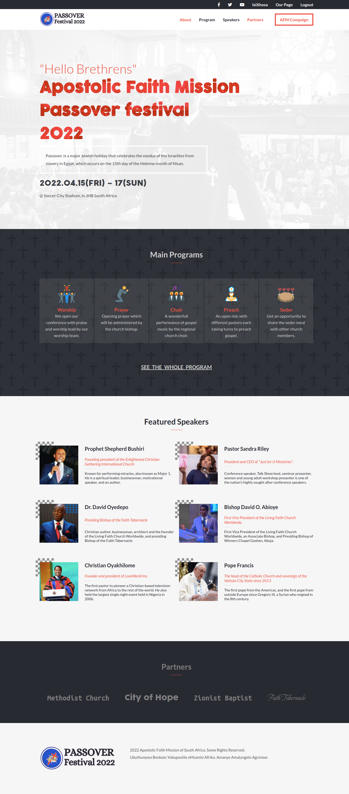

# Apostolic Faith Mission(AFM) Passover Festival Page

> This project we build is based on the passover festival which is held by many Christians/Jews. Passover, also called Pesach, is a major Jewish holiday that celebrates the exodus of the Israelites from slavery in Egypt, which occurs on the 15th day of the Hebrew month of Nisan, the first month of Aviv, or spring. AFM normally run conferences each year to celebrate this holiday, with all different kinds of speakers preaching at the ceremony. This page advertises this ceremony.

## Built With

- HTML
- CSS
- SCSS
- JavaScript

## Live Demo

[AFM Passover Festival 2022 Web Page](https://lusindiso.github.io/conference--capstone/)

## Getting Started
To run this project, you only need a computer with a browser (like Google Chrome, Mozilla Firefox, Microsoft Edge, Apple Safari, etc.) installed, and follow these steps:

To get a local copy up and running follow these simple example steps.

1- Navigate to the button on the top right green "code" button.
2- In the drop down menu choose "Download Zip".
3- After extracting the files, you'll have my project on your local machine.

## Author 👤 

- GitHub: [@Lusindiso](https://github.com/Lusindiso)
- Twitter: [@LusindisoNt](https://twitter.com/LusindisoNt)
- LinkedIn: [LinkedIn](https://www.linkedin.com/in/lusindisontanjana/)

## 🤝 Contributing

Contributions, issues, and feature requests are welcome!

Feel free to check the [issues page](../../issues/).

## Show your support

Give a ⭐️ if you like this project!

## 📝 License

This project is [MIT](./MIT.md) licensed.